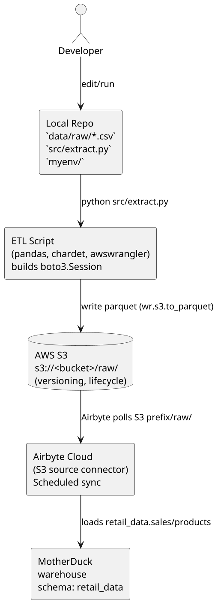

# Architecture Diagram — retailio-elt

This file documents the ETL architecture for the `retailio-elt` project, includes a copy-paste ASCII diagram and a PlantUML source block you can render locally or in VS Code.

## Quick summary

- Local CSVs: `data/raw/products.csv`, `data/raw/sales.csv`
- ETL script: `src/extract.py` (pandas + awswrangler + boto3)
- Object storage: AWS S3 (bucket used in repo scripts)
- Orchestration: Airbyte Cloud (S3 source connector)
- Warehouse: MotherDuck (schema `retail_data`)

## ASCII diagram

```
                                    +----------------------+
                                    |  Developer Laptop    |
                                    |  (local repo)        |
                                    |  - data/raw/*.csv    |
                                    |  - src/extract.py    |
                                    |  - myenv/ (venv)     |
                                    +----------+-----------+
                                               |
                                               | run `python src/extract.py`
                                               v
                           +-------------------+-------------------+
                           |             ETL Script (Python)       |
                           | - reads CSV (pandas)                  |
                           | - detects encoding (chardet/latin1)   |
                           | - builds boto3.Session (ACCESS,SECRET)|
                           | - writes parquet via awswrangler      |
                           +-------------------+-------------------+
                                               |
                                               | awswrangler -> s3://<bucket>/raw/<dataset>/
                                               v
                                 +-------------------------------+
                                 |         AWS S3 Bucket         |
                                 |  (e.g., retail-elt-bucket)    |
                                 |  - /raw/sales/ (parquet)      |
                                 |  - /raw/products/ (parquet)   |
                                 |  - versioning & lifecycle     |
                                 +-------------------------------+
                                               |
                                               | Airbyte Cloud (S3 connector)
                                               v
                         +--------------------------------------------+
                         |               Airbyte Cloud                |
                         | - Polls S3 prefix `raw/`                   |
                         | - Parses CSV/Parquet, maps schema          |
                         | - Scheduled daily syncs                    |
                         +-------------------+------------------------+
                                             |
                                             v
                            +----------------+-----------------+
                            |         MotherDuck Warehouse      |
                            | - Schema: `retail_data`           |
                            | - Tables: `sales`, `products`     |
                            | - Used for validation & analytics |
                            +-----------------------------------+
```

## PlantUML source

Save the block below as `architecture.puml` and render with PlantUML (VS Code PlantUML extension or plantuml.jar).



## Notes & repo-specific guidance

- File locations: the script expects local CSVs at `data/raw/` (see `src/extract.py`).
- Credentials: `src/extract.py` calls `load_dotenv()` and expects `ACCESS_KEY`, `SECRET_KEY`, and `REGION` environment variables. Do NOT commit real credentials.
- Bucket naming: docs and files disagree on bucket name. The repo contains references to `retailio-elt-s3` while `instructions.md` suggests `retail-elt-bucket`. I recommend making bucket configurable via `S3_BUCKET` env var.
- Encoding: `products.csv` includes non-ASCII values — script uses `latin1` or chardet detection to avoid decode errors.

## How to render the PlantUML locally (examples)

VS Code (recommended): install the "PlantUML" extension and open `architecture.puml`.

CLI (requires Java + plantuml.jar):

```bash
java -jar plantuml.jar architecture.puml
```

Docker option:

```bash
docker run --rm -v "%CD%":/workspace plantuml/plantuml -tpng architecture.puml
```

## Next actions (I can do for you)

- Add `.env.example` containing `ACCESS_KEY`, `SECRET_KEY`, `REGION`, `S3_BUCKET`.
- Update `src/extract.py` to read `S3_BUCKET` from environment and to exit non-zero on failure.
- Consolidated dependency list into `requirements.txt` at project root (moved from `src/requierments.txt`).

If you want any of those, tell me which one to do next and I will implement it.
